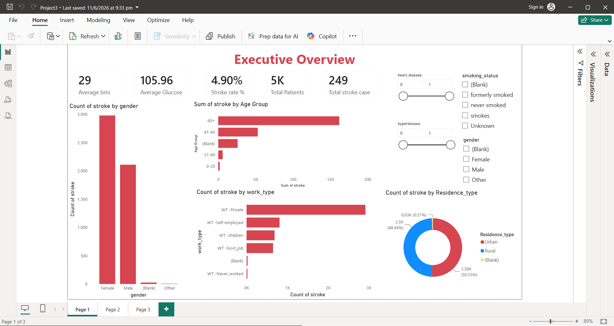
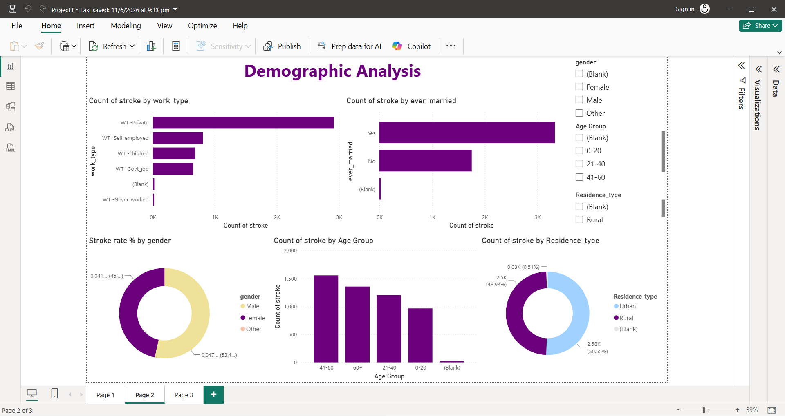
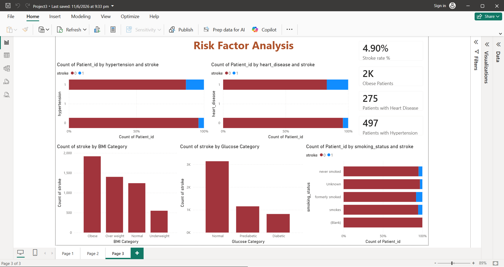

# Healthcare Stroke Risk Analysis | Excel + SQL + Power BI

## Dashboard Preview

## Project Overview

This project analyzes healthcare stroke risk data using Microsoft Excel, SQL Server, and Power BI to identify patient demographics, health indicators, and stroke risk factors. The dataset was initially reviewed and prepared in Excel, analyzed using SQL Server, and visualized through an interactive Power BI dashboard to support healthcare insights and data-driven decision-making.

## Tools Used

- Microsoft Excel
- SQL Server
- Power BI

## Project Workflow

1. Imported and reviewed the healthcare stroke dataset in Microsoft Excel.
2. Cleaned and prepared the data by handling missing values and correcting data types.
3. Imported the cleaned dataset into SQL Server.
4. Performed data analysis using SQL queries.
5. Connected SQL Server to Power BI.
6. Developed an interactive dashboard with KPIs, charts, and slicers.

## Dashboard Features

- Total Patients
- Stroke vs Non-Stroke Analysis
- Gender Distribution
- Age Group Analysis
- BMI Analysis
- Average Glucose Level
- Risk Factor Analysis
- Interactive Filters and Slicers

## Business Insights

- Identified age groups with higher stroke occurrence.
- Analyzed the relationship between BMI, glucose level, and stroke risk.
- Compared stroke distribution across gender and demographic groups.
- Built an interactive dashboard to support healthcare data analysis and reporting.

## Files Included

- `healthcare_dataset_stroke_data_v2.xlsx` – Source dataset
- `Healthcare_Stroke_Analysis.sql` – SQL scripts
- `Healthcare_Stroke_Analysis.pbix` – Power BI dashboard
- `Stroke_Analysis_Screenshot1.png` – Dashboard preview
- `Stroke_Analysis_Screenshot2.png` – Dashboard preview
- `Stroke_Analysis_Screenshot3.png` – Dashboard preview

## Skills Demonstrated

- Microsoft Excel
- SQL
- SQL Server
- Power BI
- Power Query
- DAX
- Data Cleaning
- Data Analysis
- Data Visualization
- Dashboard Development
- KPI Reporting
- Business Intelligence
